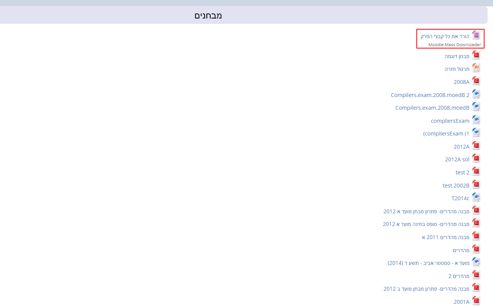
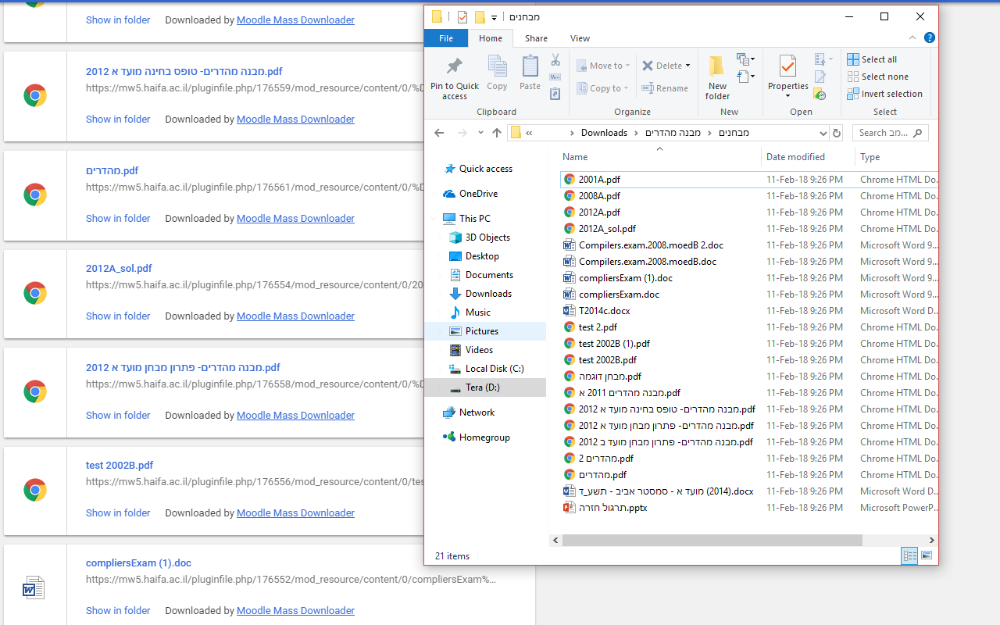

# Mass Moodle Downlaoder

A simple extention to help you mass download sections of moodle courses... _just in case_.

## Getting Started
clone the project using

```git clone https://github.com/Tadaboody/Mass-Moodle-Downloader.git```  
nothing too fancy.

## Running and debugging
Go into `chrome://extentions` and turn Developer Mode on.  
Click `Load unpacked extention...` and select the project folder  
While debugging remember to go back to the extention page and reload the extention!

## Use
Once you've installed the extention you should see this button on every section

Clicking it will download all of the section it's in into a nice folder



## Contributing
This extention was writtern and tested for [Haifa University's 2018 moodle](https://mw5.haifa.ac.il/) and its predecessors but tries to support other versions as well.  
If you happen to use a version that doesn't seem to be supported or have any bugs/features to report please open an issue or contact me at tomerpet@gmail.com while including the project name in the subject.  
## Authors

* **Tomer Keren** - [email](tomer.keren.dev@gmail.com), [github](https://www.github.com/Tadaboody)

See also the list of [contributors](https://github.com/Tadaboody/Moodle-Mass-Downloader/contributors) who participated in this project.

## License

This project is licensed under the MIT License - see the [LICENSE.md](LICENSE.md) file for details


